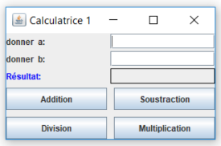
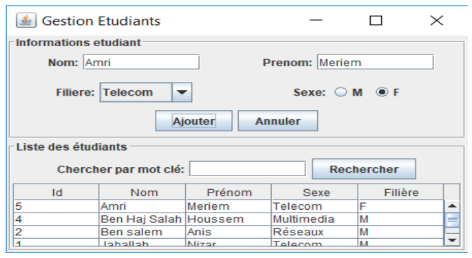

# Java GUI application

### Partie I [(Compteur)](src/compteur)

1. Ecrire un application java/swing qui permet de:
    * incrémenter un compteur
    * Décrémenter un compteur
    * Mettre à zéro un compteur
2. L’apparence de cette application est donnée par la figure suivante:

    

---

### Partie II

1. Ecrire une application java/Swing permettant la conversion euros → dinars et inversement L’apparence de cette application est donnée par la figure suivante:

    

---

### Partie III

1. Ecrire une application java/Swing intitulée « Calculatrice 1 » permettant de calculer la somme, le produit, la soustraction et la division de deux réels a et b. L’apparence de cette application est donnée par la figure suivante:

    

---

### Partie IV

On souhaite développer une application de gestion des étudiants, pour ce faire on va suivre les étapes suivantes :
* Étape 1 : Développement de la couche métier Dans cette étape on demande de créer :
    * La classe Etudiant caractérisée par : id, nom, prénom, sexe et filière. Dans cette classe :
        * Respecter le principe d'encapsulation,
        * Mettre deux constructeurs l'un en précisant l'id et l'autre sans le préciser. Dans ce 2ème cas l’id doit être auto-incrément.
    * L’interface IGestionEtudiants avec les méthodes suivantes :
        ```java
        Etudiant ajouterEtudiant(Etudiant e);
        List<Etudiant> rechercherParMC(String mc);
        void trierListeEtudiantsParNom();
        List<Etudiant> listeDesEtudiants();
        ```
    * La classe GestionEtudiants qui implémente l'interface IGestionEtudiants et redéfinir toutes les méthodes de l'interface.
* Étape 2 : Développement de la couche présentation
    * Dans cette étape on demande de créer une interface utilisateur avec la bibliothèque Swing. Cette interface permet de gérer les étudiants (voir figure ci-dessous) :

        