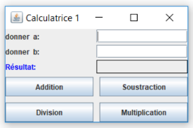

# Partie III (Calculator)

1. Ecrire une application java/Swing intitulée « Calculatrice 1 » permettant de calculer la somme, le produit, la soustraction et la division de deux réels a et b. L’apparence de cette application est donnée par la figure suivante:

    