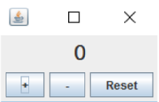

# Partie I (Compteur)

1. Ecrire un application java/swing qui permet de:
    * incrémenter un compteur
    * Décrémenter un compteur
    * Mettre à zéro un compteur
2. L’apparence de cette application est donnée par la figure suivante:

    